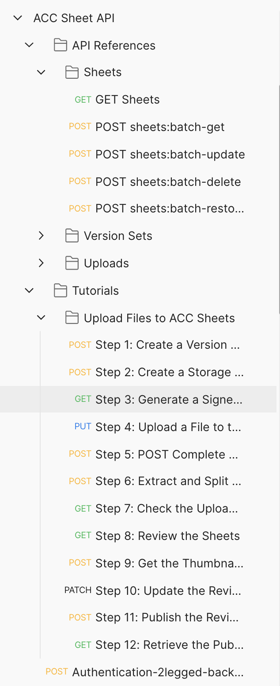

# Postman Collection for Sheet API of Autodesk Construction Cloud(ACC) 

[](https://www.getpostman.com/)
[](https://forge.autodesk.com/en/docs/acc/v1/reference/http/sheets-sheets-GET/)


[](http://opensource.org/licenses/MIT)

## Description

Change Log:
  - 10/08/2022: first release

This repository provides demos for the category of **Sheet API**. Please check [Field Guide](https://forge.autodesk.com/en/docs/acc/v1/overview/field-guide/sheets/) for more details. The API supports both 2-legged and 3-legged token .

## What's Postman?

Postman is a popular tool that provides an easy-to-use interface to send HTTP requests. Postman is able to parse the responses that Forge sends you and save response parameter values to variables. These parameters can then be reused in subsequent requests through these variables. The Postman collections in this repository use this ability to provide pre-populated HTTP requests to help you follow the tutorial workflow with minimal effort. You can also modify the requests and experiment without having to write a single line of code. 

- You can learn how to install and use Postman from [here](https://learning.getpostman.com/docs/postman/launching_postman/installation_and_updates).

- You can download the Postman installer from [here](https://www.getpostman.com/downloads/).


## Setup

1.  **Forge Account**: Learn how to create a Forge Account, activate the subscription and create an app by [this tutorial](http://learnforge.autodesk.io/#/account/). Get Forge _client id_, _client secret_ and  _callback url_. Please register Forge app with the _callback url_ as 

    ```https://www.getpostman.com/oauth2/callback```

2. **ACC Account and project**: must be Account Admin to add the app integration. [Learn about provisioning](https://forge.autodesk.com/blog/bim-360-docs-provisioning-forge-apps). 

3. Follow [product help]() to create one version set and upload some PDFs to Sheets.

4. Get ACC project id (hub id without b.) by API , or copy from browser address of ACC UI. 

5.  Clone this repository or download it. It's recommended to install [GitHub Desktop](https://desktop.github.com/). To clone it via command line, use the following (**Terminal** on MacOSX/Linux, **Git Shell** on Windows):

    ```git clone https://github.com/autodesk-forge/forge-acc-sheet.api-postman.collection```

6. Import the collection and environment files to Postman

7. In environment, input _client id_, _client secret_, _project id without b_

   <p align="center"></p>  

8. This collection takes **[Inheriting auth](https://learning.getpostman.com/docs/postman/sending-api-requests/authorization/#inheriting-auth)** to apply access token to every endpoint in the collection automatically, which means it does not need to input the token in the header explicitly.

    Although Sheet API supports both 2-legged and 3-legged token, we suggest your application adopts 3-legged token because it will follow the user permission setting of the logged user. If you need to test with 2-legged token in Postman collection, call this endpoint __Authentication-2legged-backup__ to get access_token. From the response, copy this token to the panel of **Edit** 

<p align="center"></p> 

9. To work with 3-legged token, ensure the logged user has enough permission in UI setting. 

   <p align="center"></p> 

    Next, in context menu of collection >> **Edit**, switch to the tab **Authorization**. Click **Get New Access Token**, input the variables as below:

   - Grant Type ``Authorization Code``
   - Callback URL  ``https://www.getpostman.com/oauth2/callback``
   - Auth URL  ``https://developer.api.autodesk.com/authentication/v1/authorize``
   - Access Token URL  ``https://developer.api.autodesk.com/authentication/v1/gettoken``

   - Client ID ``{{client_id}}``
   - Client Secret ``{{client_secret}}``
   - Scope ``data:read data:write``
   - Client Authentication ``Send Client credentials body``

   <p align="center"></p> 
 
    Click **Get New Access Token**, it will direct to login Autodesk account, after it succeeds, the token will be generated. Click **Use Token**. Then, click **Update** to close the window of **Edit**. 
   

## API Test

1. Assume the steps of **Setup** have been performed. The access token is ready.

2. Play the scripts. Try to change some parameters or body with more scenarios. Please check [Sheet API Reference](https://forge.autodesk.com/en/docs/bim360/v1/reference/http/data-connector-requests-POST/) for more details
   <p align="center"></p>  

## Tutorial Test

### [Upload Files to ACC Sheets](https://forge.autodesk.com/en/docs/bim360/v1/tutorials/data-connector/)

   This tutorial demos the whole workflow that uploads sheets till publishing. Please prepare some PDF files (either single page or multiple pages)

   - Step 1: create a new version set with custom name and issue date. The post-test script will make a note with the id of version set (_versionSetId_)
   - Step 2: create storage object in the bucket of Sheet of this project. The  The post-test script will extract _bucket key_ and _object key_ from the storage urn. 
   - Step 3: this is to call [Data Management API]() to generate Signed S3 URL of this storage above. The The post-test script will make a note with signed url
   - Step 4: use the signed url in Step 3 to upload the binary file (PDF)
   - Step X: call [Data Management API]() to complete the upload.
   If you want to upload more PDFs, repeate Step 2 and Step 4
   - Step X: create a new upload of Sheet with all the storage urns of the PDF. At backend of Forge, it will extract each pdf, split them to pages. Each page will be created as one Sheet.  
   - Step X: check status of the upload. If it shows IN_REVIEW, it means the sheets are extracted succefully, and ready for review.
   - Step X: get ids of the review sheets.
   - Step X: get thumnails of the review sheets as a reference when the user reviews the sheet
   - Step X: update the sheets if needed. Basically, ensure their number and title are not conflict. Otherwise, the publishing will throw exception.
   - Step X: publish the upload. It will turn the review sheets to the formal one in Sheet collection
   - Step X: you can double check by calling GET:Sheets endpoint, with the filtering of the specific version set. 

## Notes
1. currently, API does not support extract and split Revit model
2. currently, API does not support to import PDFs from Files module of ACC project. you must upload PDFs from your local (server/other cloud storage).
 
 
## Further Reading
**Document**
- [Sheet API Field Guid](https://forge.autodesk.com/en/docs/bim360/v1/overview/field-guide/data-connector/)
- [Sheet API Reference](https://forge.autodesk.com/en/docs/bim360/v1/reference/http/data-connector-requests-POST/)

**Tutorials**:
- [Upload Files to ACC Sheets](https://forge.autodesk.com/en/docs/bim360/v1/tutorials/data-connector/)

**Blogs**:
- [Forge Blog](https://forge.autodesk.com/categories/bim-360-api)
- [Field of View](https://fieldofviewblog.wordpress.com/), a BIM focused blog

## License

This sample is licensed under the terms of the [MIT License](http://opensource.org/licenses/MIT). Please see the [LICENSE](LICENSE) file for full details.

## Written by

Xiaodong Liang [@coldwood](https://twitter.com/coldwood), [Forge Partner Development](http://forge.autodesk.com)
